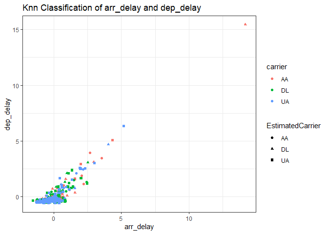
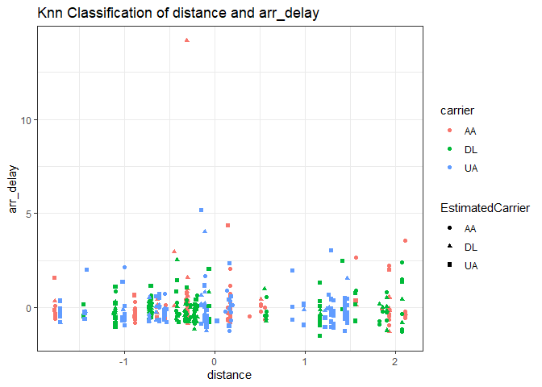
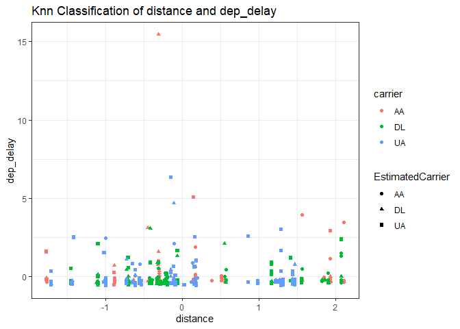
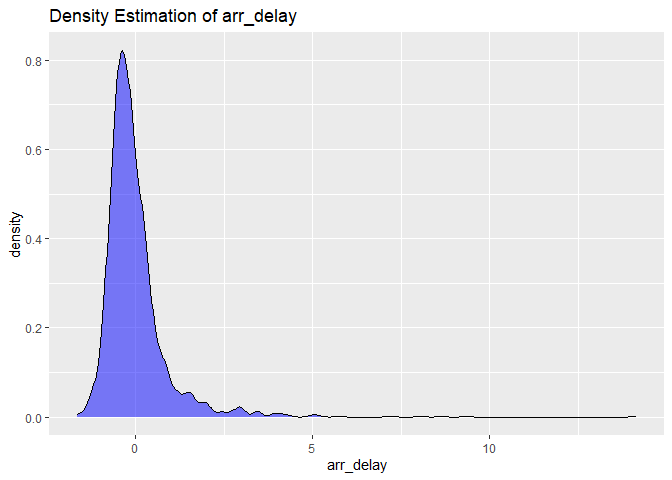
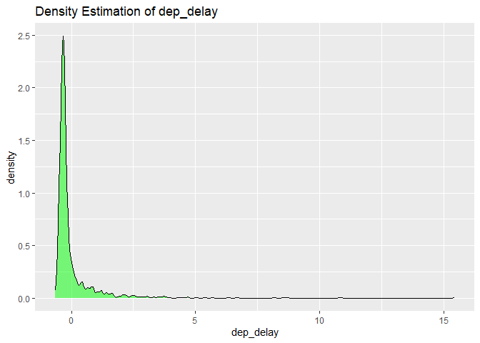
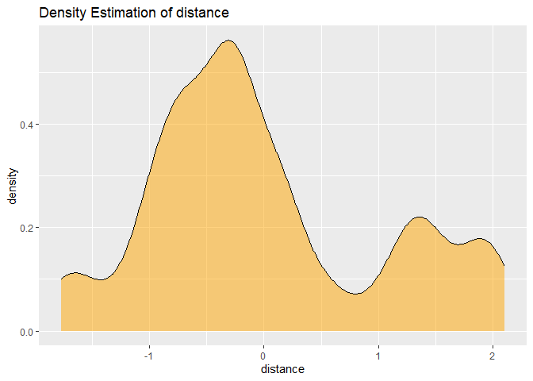
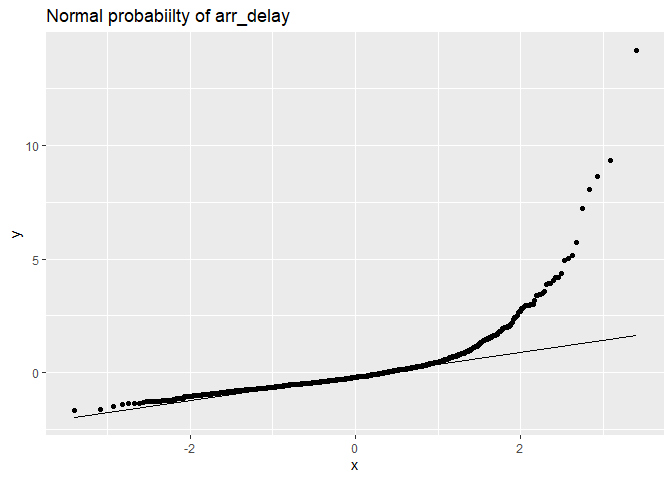
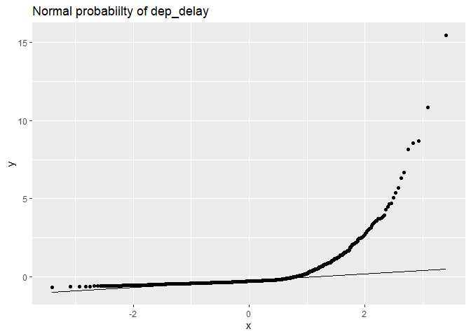
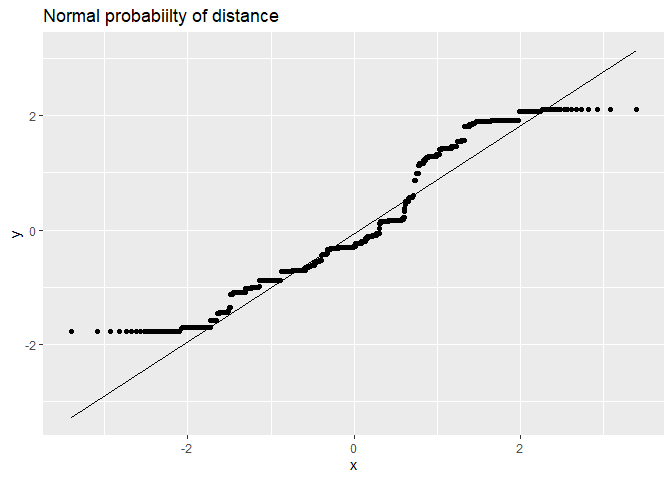
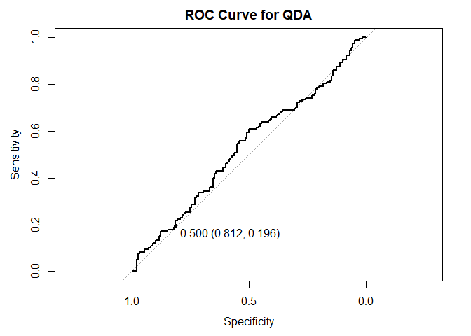

Flight Carrier Prediction
================
Natalie Eversole
2023-04-13

In this project I use the NYC flight dataset, filtered to 3 carriers,
“UA”, “AA”, “DL” and 3 features “dep_delay”, “arr_delay”,“distance”, to
predict if an observation belongs a specific carrier.

``` r
# filter dataset to the desired carriers and features
library(nycflights13)
library(dplyr)
library(ggplot2)

data(flights)
attach(flights)

set.seed(123)

flight_data = flights %>% filter(carrier %in% c("UA", "AA", "DL")) %>%
  group_by(carrier) %>%
  sample_n(500, replace=FALSE) %>%
  dplyr::select(carrier, dep_delay, arr_delay, distance) %>%
  na.omit()

flight_data$carrier = as.factor(flight_data$carrier)
```

``` r
#standardize features
flight_data = flight_data %>%
  mutate_at(vars(dep_delay, arr_delay,distance), scale)
```

``` r
#randomly split into train and test set
n = nrow(flight_data)
train_idx = sample(1:n, round(0.7 * n), replace=FALSE)
test_idx = (1:n)[-train_idx]
train_set = flight_data[train_idx, 2:4]
test_set = flight_data[test_idx, 2:4]
train_labels = flight_data$carrier[train_idx]
test_labels = flight_data$carrier[test_idx]
```

``` r
#apply 10-fold cross-validation to determine optimal k
library(class)

set.seed(123)
m=10
folds = sample(1:m,nrow(train_set), replace=TRUE)

k=3
testError1 = double(m)
for (s in 1:m) {
  trainTmp = train_set[folds!=s,]
  testTmp = train_set[folds==s,]
  trainingLabelsTmp = train_labels[folds!=s]
  testLabelsTmp = train_labels[folds==s]
  knn2= knn(trainTmp,testTmp,trainingLabelsTmp,k)
  nOfMissObs= sum(1-as.numeric(knn2==testLabelsTmp))
  terror=nOfMissObs/length(testLabelsTmp)
  testError1[s]=terror
}

terror
```

    ## [1] 0.3603604

``` r
mean(testError1)
```

    ## [1] 0.3736294

``` r
sd(testError1)
```

    ## [1] 0.06062533

``` r
kmax=10 
testErrors = matrix(0,nrow=2,ncol=kmax)
for (k in 1:kmax) { 
  testError1 = double(m) 
  for (s in 1:m) { 
    trainTmp =train_set[folds !=s,]
    testTmp =train_set[folds==s,]
    trainingLabelsTmp =train_labels[folds !=s]
    testLabelsTmp =train_labels[folds==s]
    knntmp= knn(trainTmp,testTmp,trainingLabelsTmp,k)
    nOfMissObs= sum(1-as.numeric(knntmp==testLabelsTmp))
    terror=nOfMissObs/length(testLabelsTmp) 
    testError1[s]=terror } 
    testErrors[,k]=c(mean(testError1),sd(testError1))
}

colnames(testErrors)= paste("k=",1:kmax,sep="")
rownames(testErrors)=c("mean(TestError)","sd(TestError)")
testErrors=as.data.frame(testErrors)
as.numeric(testErrors[1,])
```

    ##  [1] 0.3786152 0.4011003 0.3714617 0.3866347 0.3841138 0.4037779 0.3900452
    ##  [8] 0.4162396 0.4157215 0.4192703

``` r
hatk=which(testErrors[1,]==min(testErrors[1,]))
hatk
```

    ## [1] 3

``` r
#Apply optimal k to test set
knnOpt= knn(train_set,test_set,train_labels,hatk)
nOfMissObs1= sum(1-as.numeric(knnOpt==test_labels))
terrorOpt=nOfMissObs1/length(test_labels) # test error
terrorOpt
```

    ## [1] 0.3837472

``` r
#classification table
table(knnOpt, test_labels)
```

    ##       test_labels
    ## knnOpt  AA  DL  UA
    ##     AA  97  46  15
    ##     DL  30  72  25
    ##     UA  14  40 104

``` r
#visualizations of results
test_set$carrier=test_labels
test_set$EstimatedCarrier=knnOpt
library(ggplot2)
plot1 =ggplot(test_set,aes(arr_delay, dep_delay))+
  geom_point(aes(shape=EstimatedCarrier,color=carrier))+
  theme_bw()+
  ggtitle("Knn Classification of arr_delay and dep_delay")

plot2 =ggplot(test_set,aes(distance, arr_delay))+
  geom_point(aes(shape=EstimatedCarrier,color=carrier))+
  theme_bw()+
  ggtitle("Knn Classification of distance and arr_delay")

plot3 =ggplot(test_set,aes(distance, dep_delay))+
  geom_point(aes(shape=EstimatedCarrier,color=carrier))+
  theme_bw()+
  ggtitle("Knn Classification of distance and dep_delay")

plot1
```

<!-- -->

``` r
plot2
```

<!-- -->

``` r
plot3
```

<!-- -->
This error rate of 0.3747 is higher than ideal and as we can see in the
visualization’s, the clustering of our knn model does not accurately
match the grouping of our original dataset.

``` r
#check if Gaussian assumption is satisfied
library(ggplot2)

#density plots
arr_densityPlot = ggplot(flight_data, aes(x = arr_delay)) +
  geom_density(fill = "blue", alpha = 0.5) +
  ggtitle("Density Estimation of arr_delay")
arr_densityPlot
```

<!-- -->

``` r
dep_densityPlot = ggplot(flight_data, aes(x = dep_delay)) +
  geom_density(fill = "green", alpha = 0.5) +
  ggtitle("Density Estimation of dep_delay")
dep_densityPlot
```

<!-- -->

``` r
distance_densityPlot = ggplot(flight_data, aes(x = distance)) +
  geom_density(fill = "orange", alpha = 0.5) +
  ggtitle("Density Estimation of distance")
distance_densityPlot
```

<!-- -->

``` r
#normal probability plots
arr_ProbPlot = ggplot(flight_data, aes(sample=arr_delay)) + 
  geom_qq() +
  stat_qq_line()+
  ggtitle("Normal probabiilty of arr_delay")
arr_ProbPlot
```

<!-- -->

``` r
dep_ProbPlot = ggplot(flight_data, aes(sample=dep_delay)) + 
  geom_qq() +
  stat_qq_line()+
  ggtitle("Normal probabiilty of dep_delay")
dep_ProbPlot
```

<!-- -->

``` r
distance_ProbPlot = ggplot(flight_data, aes(sample=distance)) + 
  geom_qq() +
  stat_qq_line()+
  ggtitle("Normal probabiilty of distance")
distance_ProbPlot
```

<!-- -->
arr_delay and dep_delay have a bell shaped density plot so they are
assumed to be normally distributed. The probability plots of arr_delay
and dep_delay fall along a straight line and can be assumed to be
normally distributed, however arr_delay and dep_delay are skewed right.
We can assume that arr_delay and dep_delay follow a Gaussian
distribution.

``` r
#Train QDA model on the training set
library(MASS)

train_set$carrier=train_labels
qda.model = qda(carrier ~ arr_delay+dep_delay+distance, data = train_set)

# Apply trained QDA model to test set
qda.pred <- predict(qda.model, test_set)

#Estimated mixing proportion
qda.model$prior
```

    ##        AA        DL        UA 
    ## 0.3375242 0.3210832 0.3413926

``` r
#Estimated mean vector
qda.model$means
```

    ##      arr_delay   dep_delay     distance
    ## AA -0.05619124 -0.03999563 -0.001024504
    ## DL  0.03069052  0.04059093 -0.011157490
    ## UA  0.02514193  0.01426332 -0.035603135

``` r
# Classification table
table(qda.pred$class, test_set$carrier)
```

    ##     
    ##       AA  DL  UA
    ##   AA 126 135 124
    ##   DL  12  15  14
    ##   UA   3   8   6

``` r
test_error = mean(qda.pred$class != test_set$carrier); test_error
```

    ## [1] 0.6681716

Based on the estimated population proportions for each carrier, it seems
that each carrier has roughly the same proportion of observations in the
test set. Therefore, it is reasonable to conclude that if you randomly
pick an observation on the 3 standardized features, it is approximately
equally likely to belong to each of the 3 carriers.

This QDA model did not perform very well. It has a test error rate of
0.66, which means the model correctly predicts the carrier only 34% of
the time.

``` r
# Extract UA, DL from train set
ua_dl_train = train_set %>% filter(carrier %in% c("UA", "DL"))
ua_dl_train$carrier <- as.factor(as.character(ua_dl_train$carrier))

# Extract UA, DL from test set
ua_dl_test = test_set %>% filter(carrier %in% c("UA", "DL"))
ua_dl_test$carrier <- as.factor(as.character(ua_dl_test$carrier))
# Remove EstimatedCarrier column
ua_dl_test <- ua_dl_test[,-5]

# Train QDA model on new train set
new.qda.model = qda(carrier ~ dep_delay+arr_delay+distance, data = ua_dl_train)
new.qda.pred <- predict(new.qda.model, ua_dl_test)

# Test error
new_test_error = mean(new.qda.pred$class != ua_dl_test$carrier); new_test_error
```

    ## [1] 0.5099338

``` r
# ROC curve
library(pROC)
roc_data <- roc(ua_dl_test$carrier, new.qda.pred$posterior[,2], levels = c("UA", "DL"))
plot(roc_data, print.thres = c(0.5), main = "ROC Curve for QDA")
```

<!-- -->

``` r
auc <- auc(roc_data); auc
```

    ## Area under the curve: 0.5272

This model produced an error rate of 0.51. This tells us that the model
will predict the correct carrier 49% of the time. This is a significant
improvement form the initial QDA model, however it is not sufficiently
accurate.
